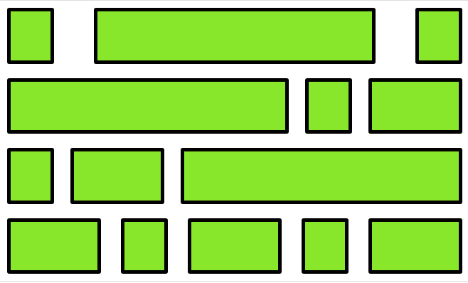
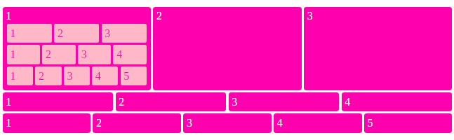
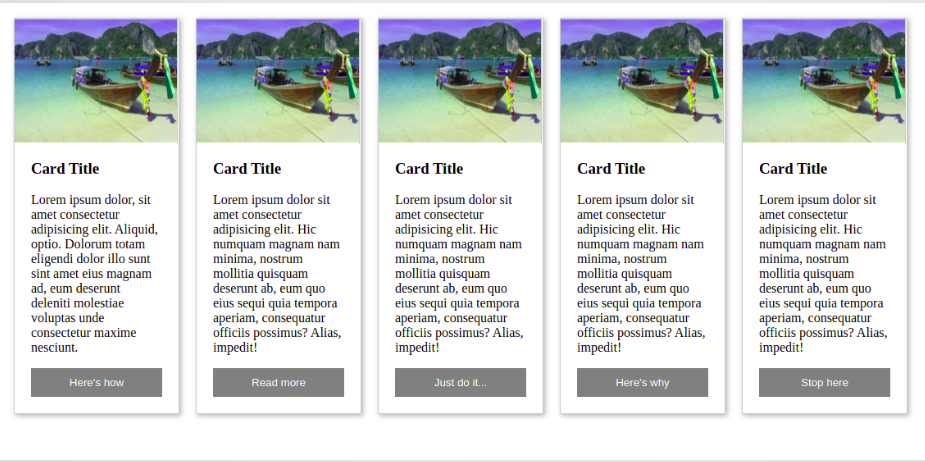
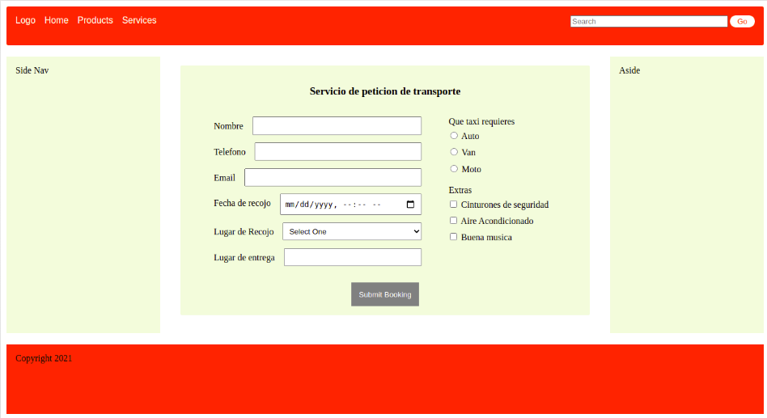

<!-- Indicaciones Generales -->

## Indicaciones Generales.

- Cada ejercicio debe estar alojado en su propia carpeta.
- Debe existir al menos un archivo index.html en el que se desarrolle el core del ejercicio.
- Los archivos staticos (css, imagenes) deben estar alojados dentro de una carpeta nombrada static.
- Cada ejercicio debe extraer los estilos de una hoja externa nombrada como styles.css ubicada dentro del directorio de archivos estaticos.

<!-- Ejercicio 01-->

## Ejercicio 01

Crear el siguiente layout haciendo uso de flex-box y las demas herramientas aprendidas.

**Resultado esperado**

## Ejercicio 02

Crear el siguiente layout haciendo uso de flex-box y las demas herramientas aprendidas.

**Resultado esperado**

## Ejercicio 03

Se deben crear 5 cartas (estilo pre-view de un blog) en donde cada una de ellas contenga una imagen, titulo, un texto descriptivo y un boton para extender visualizacion (no se requiere que el boton realice ninguna accion) Consideraciones:

- Las cartas deben hacer wrap
- Las cartas deben tener sombreado en los bordes
- Los elementos deben estar alineados a preferencia de cada uno.

**Resultado esperado**

## Ejercicio 04

Se debe, haciendo uso de las habilidades adquiridas, desarrollar un layout estructurado de la siguiente manera: Barra de navegacion en el top de la pagina conteniendo de 1 a 4 links en el extremo izquierdo de la pagina y un campo de busqueda de texto y boton (mini-formulario) en el extremo derecho de esta Footer en el pie de la pagina y agregar algo de texto de preferencia Sidebar izquierdo en el cuerpo de la pagina, bastara con un rectangulo sin nada en el mas que el texto sidebar (agregar elementos y/o estilo sumara puntos extras) Sidebar derecho en el cuerpo de la pagina, bastara con un rectangulo sin nada en el mas que el texto sidebar (agregar elementos y/o estilo sumara puntos extras) El centro del cuerpo de la pagina (entre ambos side bars) debe contener un formulario en el que se haga uso de los inputs de tipo: Texto, Email, Fecha, DropDown (select, options), radio boxes, checkboxes y boton de envio

**Resultado esperado**

