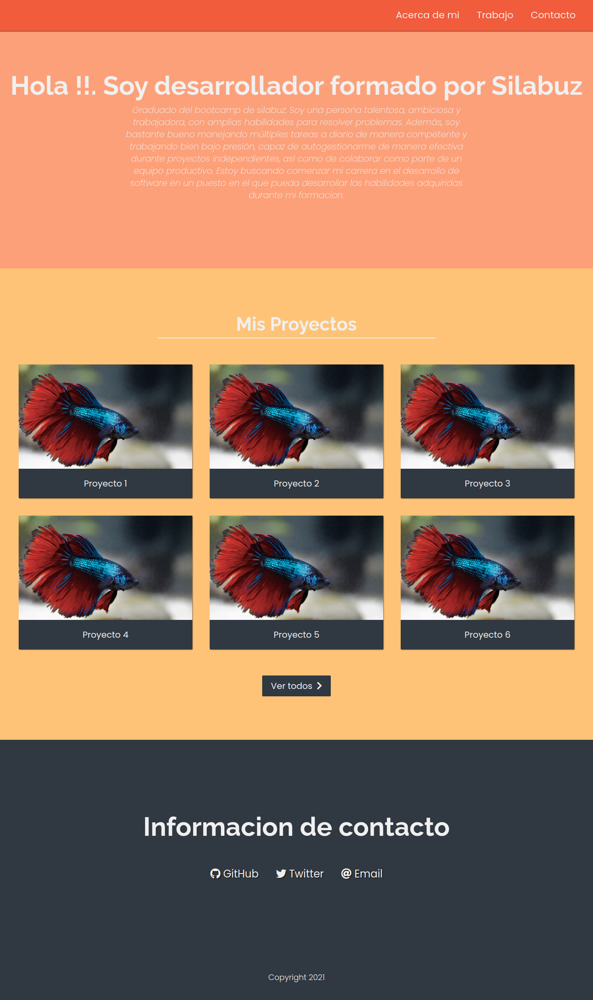

<!-- Indicaciones Generales -->
<h1> Indicaciones Generales.</h1> 
<li>El ejercicio debe estar alojado en su propia carpeta.</li>
<li>Debe existir al menos un archivo index.html en el que se desarrolle el core del ejercicio.</li>
<li>Los archivos staticos (css, imagenes) deben estar alojados dentro de una carpeta nombrada static.</li>
<li>Cada ejercicio debe extraer los estilos de una hoja externa nombrada styles.css ubicada dentro del directorio de archivos estaticos.</li>

 

<!-- Ejercicio -->
<h1> Ejercicio </h1> 
<h2>Planteamiento del problema</h2>

Se requiere crear una pagina web estilo portafolio personal estructurada de forma  que:

<li>Se tenga una barra de navegacion que se mantega en el top incluso cuando se haga scroll</li> 
<li>Seccion de presentacion como desarrollador</li>
<li>Seccion donde listen sus proyectos</li>
<li>Footer al pie de la pagina</li>

 
<h2>Resultado esperado </h2>
</img>
 
 
