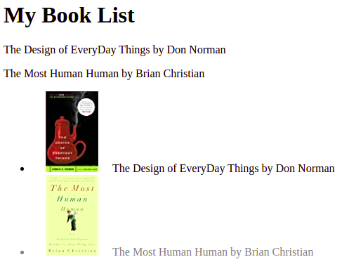

## 1 Exercise

Escribe un programa JavaScript para calcular el volumen de una esfera a traves del radio de la misma.
ECUACION:
( 4 / 3) _ Pi _ radio^3

## 2 Exercise

Escriba un programa JavaScript para mostrar una imagen aleatoria haciendo clic en un botón (Las imagenes son a eleccion libre).

## 3 Exercise

Crear una lista de libros sin hacer uso de etiquetas HTML, solo javascript

