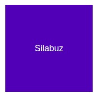
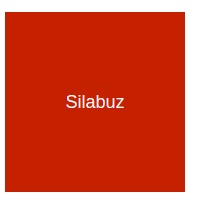
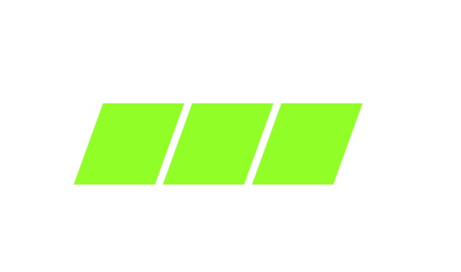
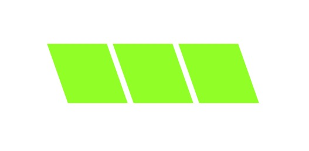
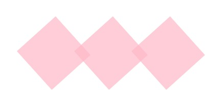
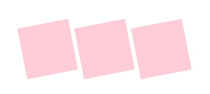

<!-- Indicaciones Generales -->
<h1> Indicaciones Generales.</h1> 
<li>Cada ejercicio debe estar alojado en su propia carpeta.</li>
<li>Debe existir al menos un archivo index.html en el que se desarrolle el core del ejercicio.</li>
<li>Los archivos staticos (css, imagenes) deben estar alojados dentro de una carpeta nombrada static.</li>
<li>Cada ejercicio debe extraer los estilos de una hoja externa nombrada como styles.css ubicada dentro del directorio de archivos estaticos.</li>  

<!-- Ejercicio 01-->
<h1> Ejercicio 01 </h1> 
<h2>Planteamiento del problema</h2>

 Se necesita crear una caja con el color de su preferencia y aplicar
    transicion de color a la misma cuando se pose el puntero sobre ella.

 
<h2>Resultado esperado </h2>
</img>
</img>
 
 

<!-- Ejercicio 02-->
<h1> Ejercicio 03 </h1> 
<h2>Planteamiento del problema</h2>

  Se necesitan crear tres contenedores que representaran 3 cuadrados. Se deben usar animaciones y transformaciones para hacer mover lo cuadrados. Pasos a seguir:

<h2>Indicaciones Especificas:</h2>
<li>desde el "from" en el keyframe sesgar (skew) los cuadrados 20 grados con respecto al eje x</li> 
<li>hasta el "to" del keyframe sesgar (skew) los cuadrados -20 grados con respecto al eje y</li>
<li>Utilizar animacion para repetir esto infinitamente (infinite)</li>
<li>Utilizar parametro animation-direction como alternate</li>
 
<h2>Resultado esperado </h2>
</img>
</img>
 
 

<!-- Ejercicio 02-->
<h1> Ejercicio 02 </h1> 
<h2>Planteamiento del problema</h2>

  Se necesitan crear tres contenedores que representaran 3 cuadrados. Se deben usar animaciones y transformaciones para hacer mover lo cuadrados. Pasos a seguir:
<h2>Indicaciones Especificas:</h2>
<li>desde el "from" en el keyframe rotar (skew) los cuadrados 0 grados</li> 
<li>hasta el "to" del keyframe rotar (skew) los cuadrados 360 grados</li>
<li>Utilizar animacion para repetir esto infinitamente (infinite)</li>
<li>Utilizar parametro animation-direction como alternate</li>
 
<h2>Resultado esperado </h2>
</img>
</img>
 
 
