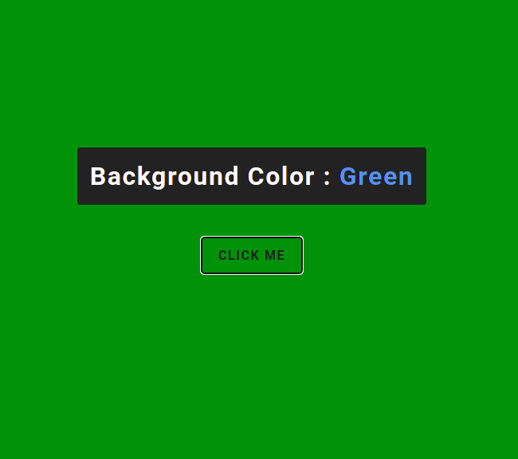
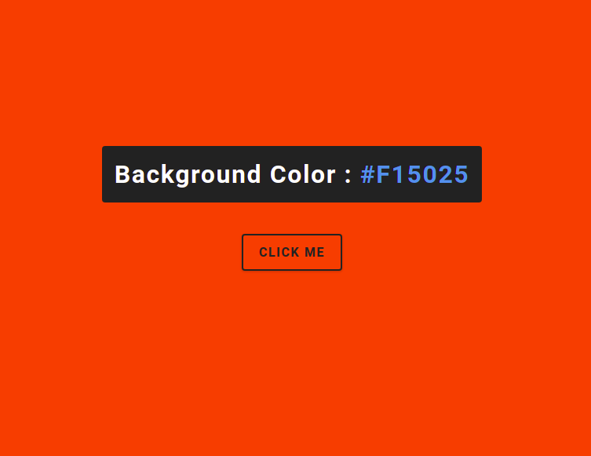

## 1 Exercise

Crear un contandor haciendo uso de las habilidades aprendidas, este debe porder incrementar, decremetar y reiniciar la cuenta.

## 2 Exercise

Desarrolle una pagina haciendo uso de las habilidades aprendidas. Esta debe de mostrar una lista de preguntas y al hacer click en un boton deben desplegar una respuesta.

## 3 Exercise

Desarrolle una pagina con funcionalidad que permita el cambio del color de fondo.

