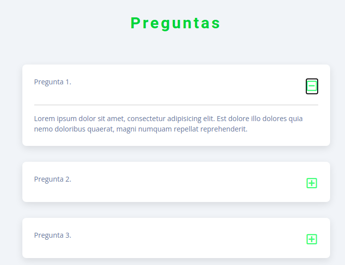

## 1 Exercise

Crear un contandor haciendo uso de las habilidades aprendidas, este debe poder incrementar, decremetar y reiniciar la cuenta.

#### condiciones:

- Si el numero (contador actual) es multiplo de 2, El color del background debe cambiar
- Si el numero es multiplo de 3, el color y tipo de letra del numero deben cambiar
- Si el numero es primo, Los botones y texto de los mismos deben cambiar de color ( diferente al del background )
- si el numero es primo, lanzar una alerta con un mensaje notificando que es un numero primo.

## 2 Exercise

Desarrolle una pagina haciendo uso de las habilidades aprendidas. Esta debe de mostrar una lista de preguntas y al hacer click en un boton deben desplegar una respuesta. Ojo, no se acepta el uso de bootstrap para el desarrollo de este ejercicio.

## 3 Exercise

Desarrolle una app que permita el registro de articulos para una lista de compras.

Cada articulo ingresado desde el formulario debe ser agregado a la lista como se muestra en la imagen:

Igualmente se debe incluir soporte para la eliminacion de articulos de la lista. A continuacion se puede ver que el articulo "Pan" fue eliminado

Por ultimo debe permirtirse la actualizacion de los articulos. A continuacion se muestra el articulo "Cafe" actualizado a "Cafe instantaneo"

