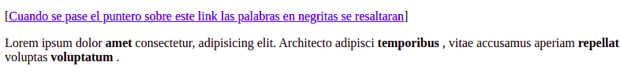
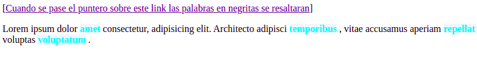
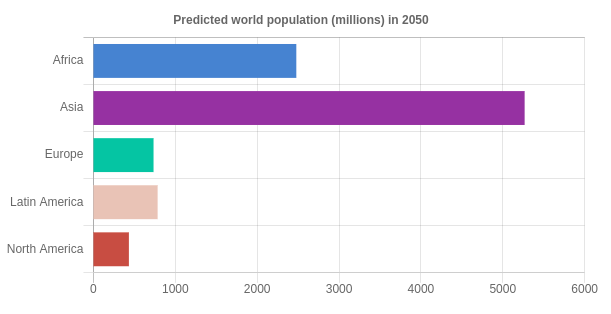
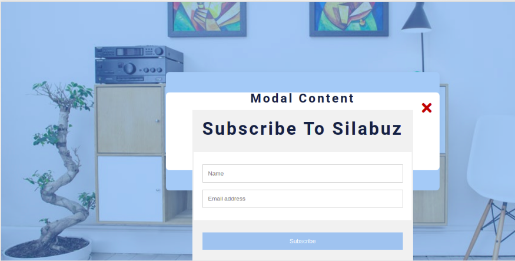

## 1 Exercise

Escribir una funcionalidad con javascript que resalte las palabras en negritas cuando el puntero se posicione sobre cierto link.

## 2 Exercise

Haciendo uso de chart.js crear un gráfico de barras horizontal como se muestra en la imagen

## 3 Exercise

Crear una web con un “modal” haciendo uso de javascript, html y css. Al hacer click en el botón open modal se debe desplegar un formulario de suscripción.

