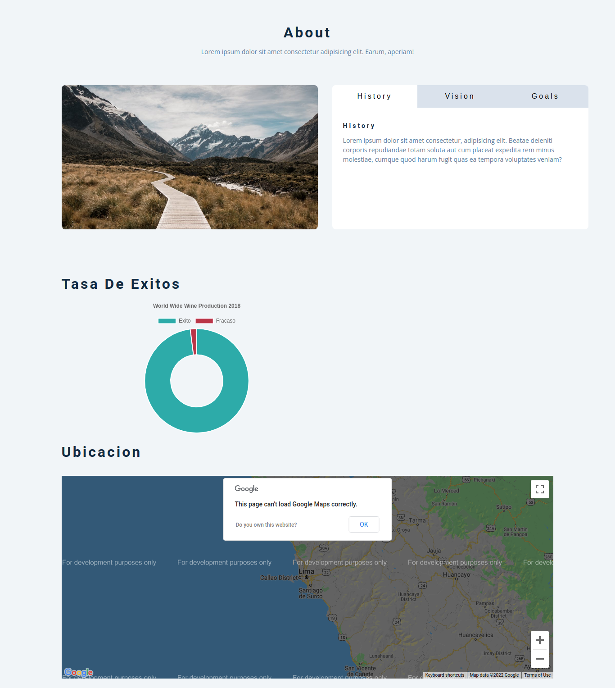

## 1 Exercise

Desarrolle un sitio web como se muestra a continuación:

- Es requerido que cuando se haga click a un tab este que selecionado y se despliega la información correspondiente a ese tab.
- Se requiere la visualización de un gráfico.
- Se requiere la visualización de un mapa con su localización (en el ejemplo se muestra peru-lima).

