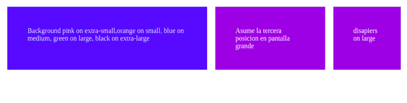
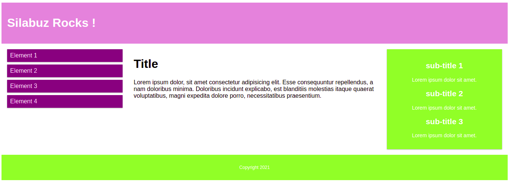
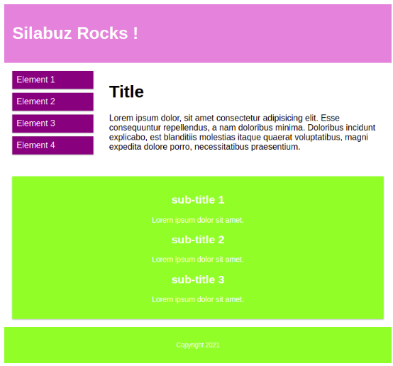
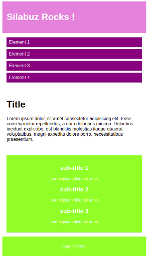
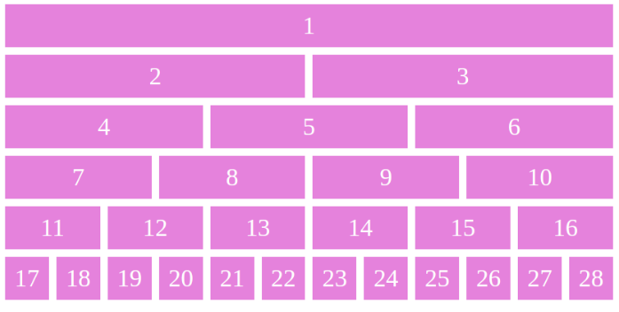
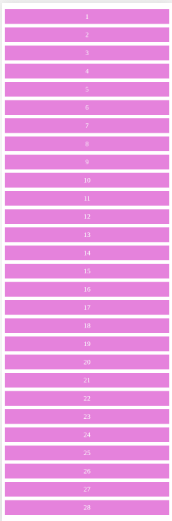

<!-- Indicaciones Generales -->

## Indicaciones Generales.

- Cada ejercicio debe estar alojado en su propia carpeta.
- Debe existir al menos un archivo index.html en el que se desarrolle el core del ejercicio.
- Los archivos staticos (css, imagenes) deben estar alojados dentro de una carpeta nombrada static.
- Cada ejercicio debe extraer los estilos de una hoja externa nombrada como styles.css ubicada dentro del directorio de archivos estaticos.

<!-- Ejercicio 01-->

## Ejercicio 01

Cumplir las condiciones requeridas:

- primer cuadrado: Background pink en extra-small, orange en small, blue en medium, green en large y black on extra-large.
- Asume la tercera posicion en pantalla grande.
- Desaparece en large.

**Resultado esperado**

## Ejercicio 02

Preparar layout, debe re-ajustar su estructura dependiendo del tamanho de la pantall.

**Resultado esperado (large)**

**Resultado esperado (medium)**

**Resultado esperado (small)**

## Ejercicio 03

Preparar el siguiente layout.

**Resultado esperado**

**Resultado esperado (small)**

