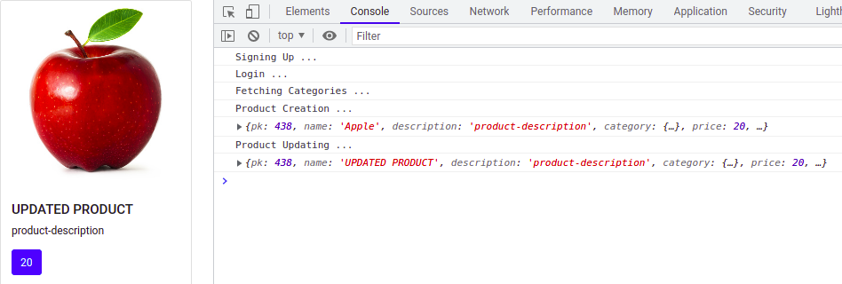

## 1 Exercise

Haciendo uso de axios o fetch hacer las peticiones necesarias para alcanzar el objetivo de:

1. Registrarse en la plataforma como usuario usando el EndPoint
   https://silabuz-api-project.herokuapp.com/authentication/sign-up/

#### BODY PARA REGISTRO

{
"username": "test",
"email": "test@gmail.com",
"password": "123456"
}

2. Logearse en la plataforma como usuario usando el EndPoint
   https://silabuz-api-project.herokuapp.com/authentication/login/

#### BODY PARA EL LOGIN

{
"username": "test",
"password": "123456"
}

3. Una vez obtenida la data del login y habiendonos autenticados (recibido el token). Hacer una peticion para crear un articulo usando el siguiente EndPoint:
   https://silabuz-api-project.herokuapp.com/products/products/

#### BODY PARA CREACION DEL REGISTRO

{
"name": "product-name",
"category_id": categoryID,
"description": "product-description",
"price": 20,
"image_url": "http://product-url.com",
}

-- las categorias para obtener un category ID se obtienen del EndPoint:
https://silabuz-api-project.herokuapp.com/products/categories/

**_ Usar cualquier categoria _**

4. Una vez creado el producto debemos actualizar su nombre a "UPDATED PRODUCT" usando el EndPoint:
   https://silabuz-api-project.herokuapp.com/products/products/IDhere/

#### BODY PARA EL UPDATE

{
"name": "UPDATED PRODUCT",
}

5. Mostrar el registro en la pantalla en un formato de carta.

TODOS ESTOS PASOS DEBEN DE DESENCADENARSE CON EL CLICK DE UN BOTON.

