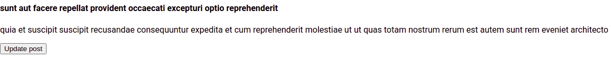
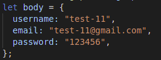
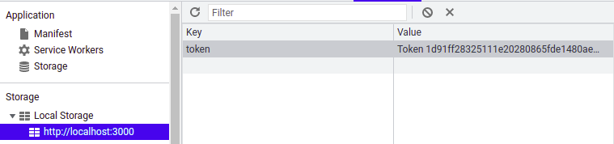
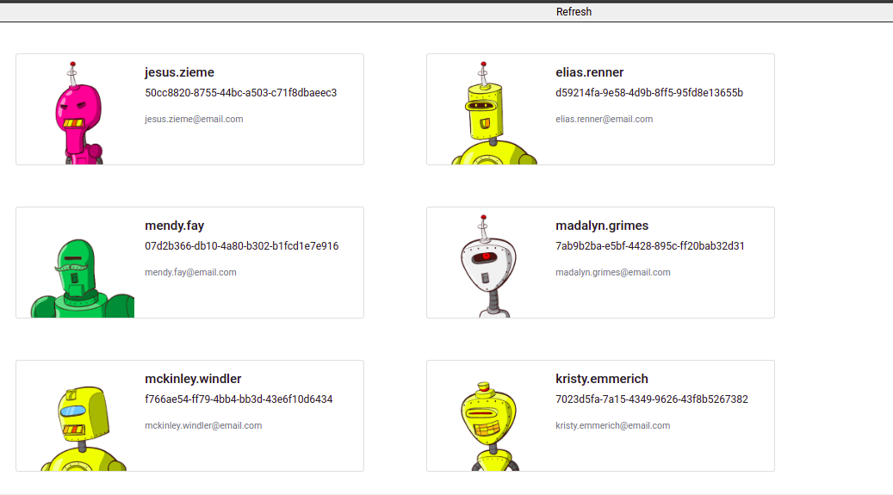
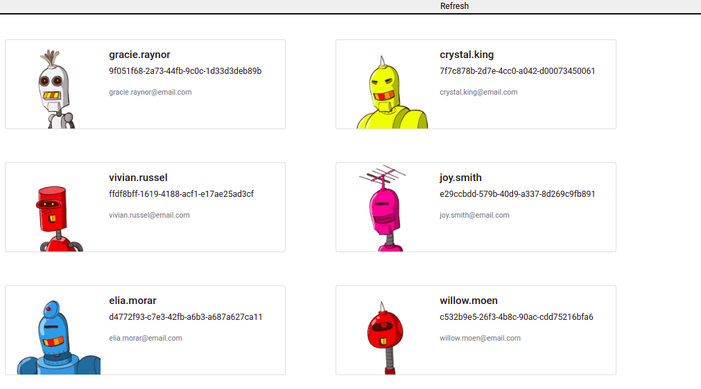

## 1 Exercise

Haciendo uso de axios hacer hace un update al siguiente end point cuando se haga click a un boton:

URL: https://jsonplaceholder.typicode.com/posts

## 2 Exercise

Manejar Login y registro de usuarios con axios:
**_ Ambos son metodos POST _**

usar el ENDPOINT para registro de usuario: https://silabuz-api-project.herokuapp.com/authentication/sign-up/

usar el ENDPOINT para login: https://silabuz-api-project.herokuapp.com/authentication/login/

#### BODY PARA REGISTRO

{
"username": "test",
"email": "test@gmail.com",
"password": "123456"
}

#### BODY PARA EL LOGIN

{
"username": "test",
"password": "123456"
}

Luego de finalizado el login guardar el token de la respuesta en el localstorage.

NOTA: no se necesita un formulario de login o registro, los valores de los parametros del body se pueden cargar arbitrariamente.

## 3 Exercise

Consumir la siguiente API usando axios

URL: https://random-data-api.com/api/users/random_user?size=10

Este End Point retorna data random.
El parametro size se usa para delimitar la cantidad de registros que se reciben.

Se desea consumir la API y lista los personajes en la pantalla.
Se debe tener un boto que diga refresh y traiga diferentes personajes a la pantalla.

Click en refresh ...

