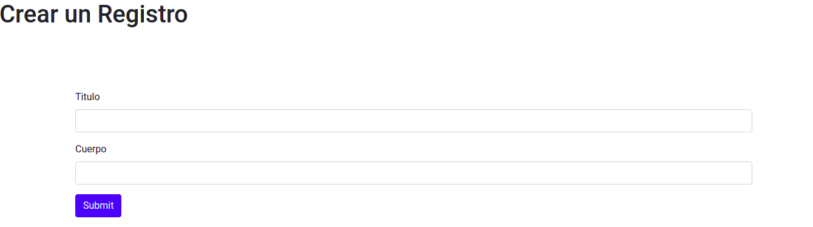
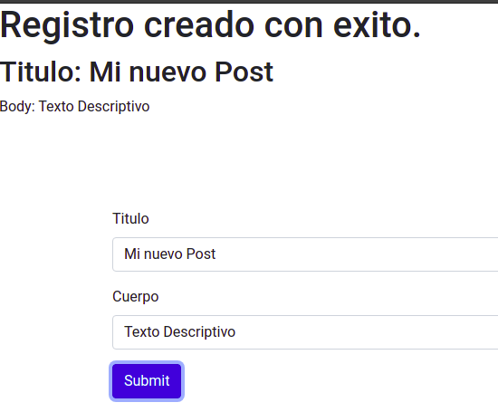
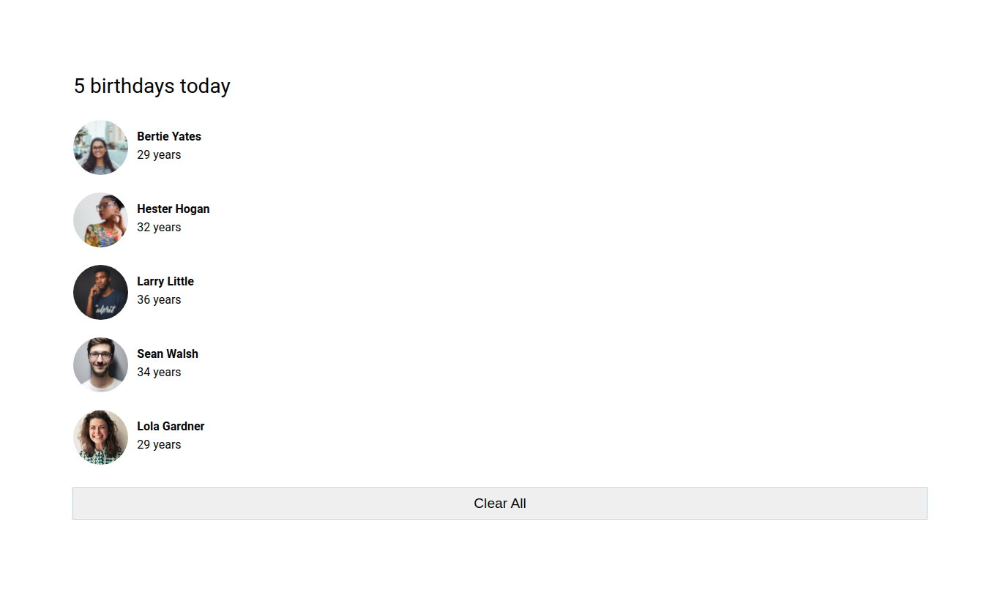
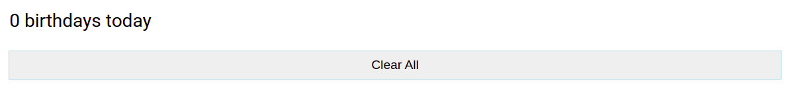
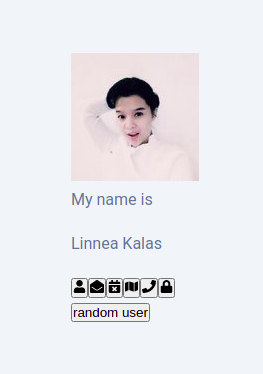
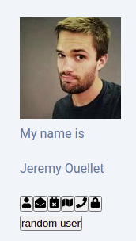
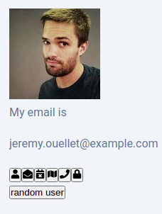

## 1 Exercise

Crear un formulario que permita la creacion de un "post" por medio de una consulta con axios de creacion al siguiente EndPoint:

URL: https://jsonplaceholder.typicode.com/posts/1

## 2 Exercise

Mostrar una lista de data (avatares de personas) desde una aplicacion react. Debe permitir la limpieza de la lista

## 3 Exercise

Consumir la API de URL: https://randomuser.me/api/

Se debe traer una persona random cuando se haga click.

Al hacer hover sobre los iconos la carta debe de mostrar la informacion adecuada.

Ejemplo 1: Hover sobre el icono de correo se muestra el correo de la persona..

Ejemplo 2: Hover sobre el icono de telefono se muestra el teleforno de la persona.

