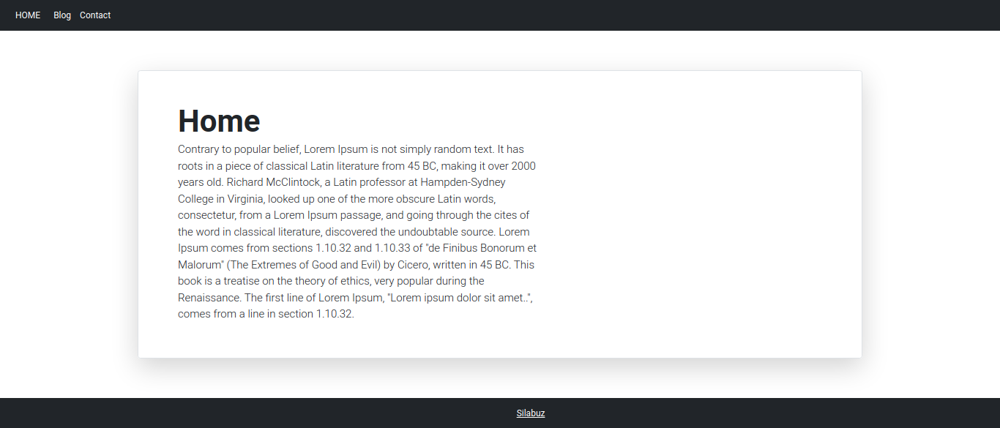
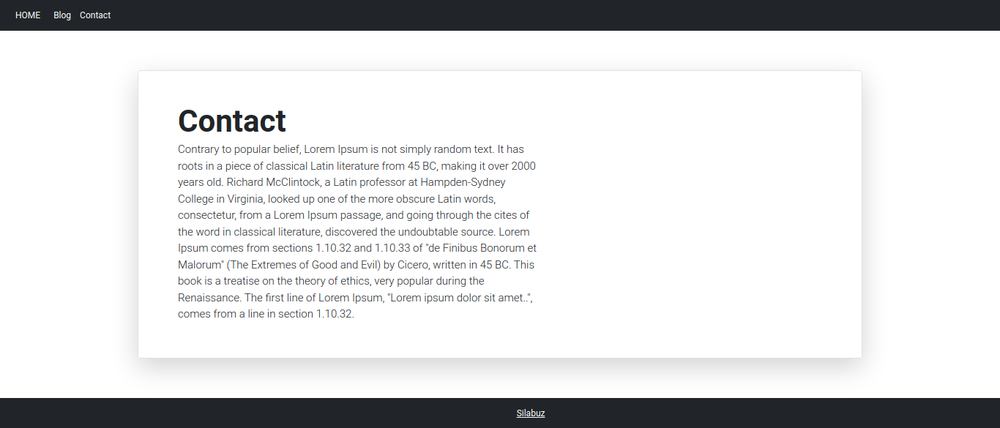
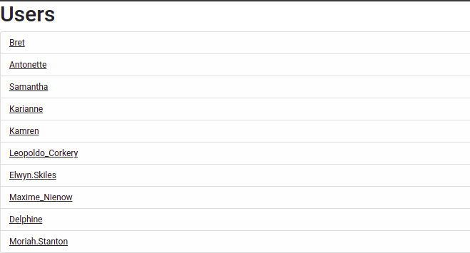
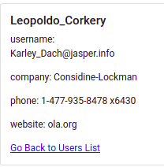
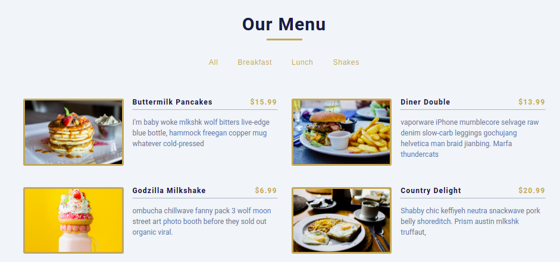
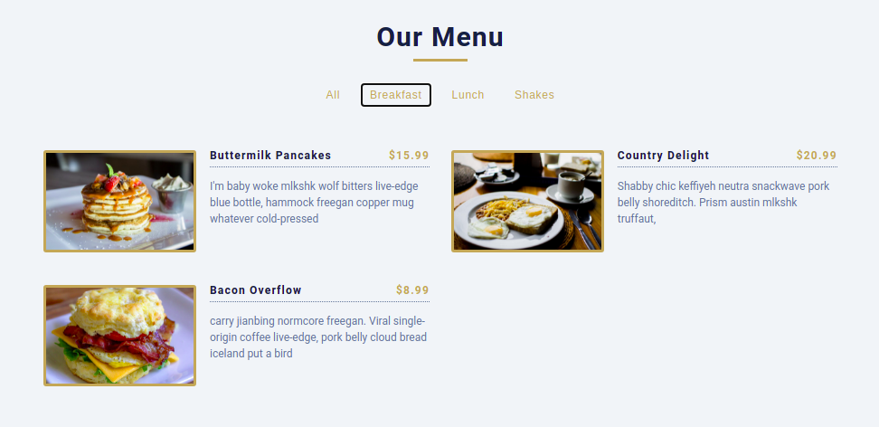

## 1 Exercise

Crear un layout que al menos contenga una barra de navegacion y un pie de pagina. Crear al menos 3 componentes que representen secciones de la pagina. El hacer click sobre los links debe permitirme navegar entre estos componentes mientras que el layout se mantiene.

## 2 Exercise

Consumiendo la API:

https://jsonplaceholder.typicode.com/users

Listar los usuarios (nombre) en un componente y redirecionar al detalle de estos cuando se clickee sobre el usuario.

## 3 Exercise

Crear una app web como se muestra a continuacion.

Se Debe permitir el filtro de los elementos listados por categoria.

NOTA: La data debe ser declarada en un archivo JSON.

Ejemplo de un objeto:

{
id: 1,
title: "pancakes",
category: "breakfast",
price: 15.99,
img: "/images/image1.jpg,
desc: "Description............",
}
