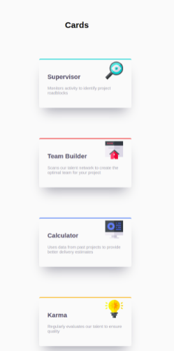

<!-- Indicaciones Generales -->

## Indicaciones Generales.

- Cada ejercicio debe estar alojado en su propia carpeta.
- Debe existir al menos un archivo index.html en el que se desarrolle el core del ejercicio.
- Los archivos staticos (css, imagenes) deben estar alojados dentro de una carpeta nombrada static.
- Cada ejercicio debe extraer los estilos de una hoja externa nombrada como styles.css ubicada dentro del directorio de archivos estaticos.

<!-- Ejercicio 01-->

## Ejercicio 01

Crear cartas utilizando las herramientas aprendidas html y css, recordar aplicar el uso de sombras.

**Resultado esperado**

