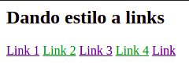
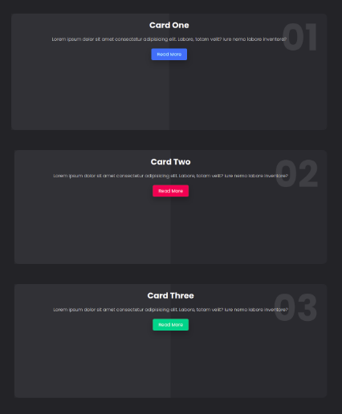

<!-- Indicaciones Generales -->

## Indicaciones Generales.

- Cada ejercicio debe estar alojado en su propia carpeta.
- Debe existir al menos un archivo index.html en el que se desarrolle el core del ejercicio.
- Los archivos staticos (css, imagenes) deben estar alojados dentro de una carpeta nombrada static.
- Cada ejercicio debe extraer los estilos de una hoja externa nombrada como styles.css ubicada dentro del directorio de archivos estaticos.

<!-- Ejercicio 01-->

## Ejercicio 01

Cambiar el color de cada segundo link cuando el cursor este sobre el, cuando se haya visitado y cuando este activo.

**Resultado esperado**

## Ejercicio 02

Haciendo uso de pseudo clases lograr el siguiente efecto (iluminar image) al posar el puntero sobre una imagen de una galeria de ellas.

**Resultado esperado**

## Ejercicio 03

Lograr el movimiento de las cartas y cambio de color de los botones.

**Resultado esperado**

