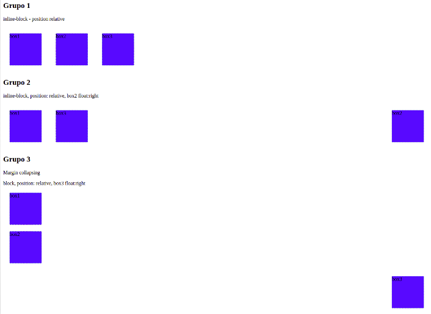
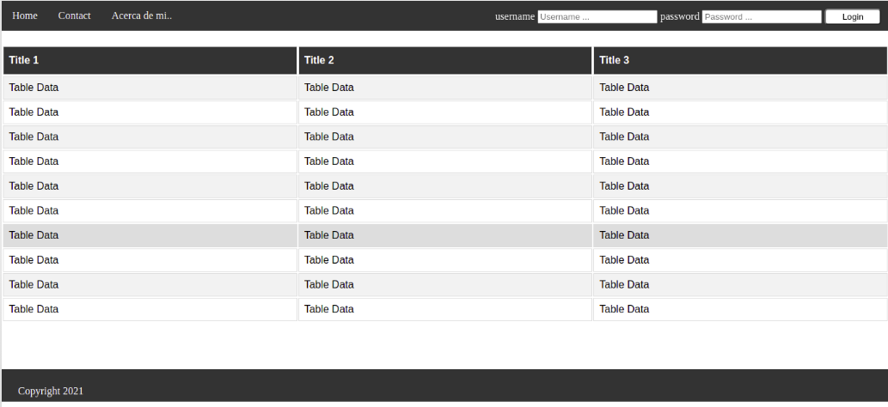

<!-- Indicaciones Generales -->

## Indicaciones Generales.

- Cada ejercicio debe estar alojado en su propia carpeta.
- Debe existir al menos un archivo index.html en el que se desarrolle el core del ejercicio.
- Los archivos staticos (css, imagenes) deben estar alojados dentro de una carpeta nombrada static.
- Cada ejercicio debe extraer los estilos de una hoja externa nombrada como styles.css ubicada dentro del directorio de archivos estaticos.

<!-- Ejercicio 01-->

## Ejercicio 01

Jugar con el posicionamiento como se muestra en la image.

**Resultado esperado**

## Ejercicio 02

Preparar pagina web haciendo uso de posicionamiento y demas herramientas aprendidas.

**Resultado esperado**

## Ejercicio 03

Preparar pagina web haciendo uso de posicionamiento y demas herramientas aprendidas.

Selecionar imagenes de preferencia

**Resultado esperado**

