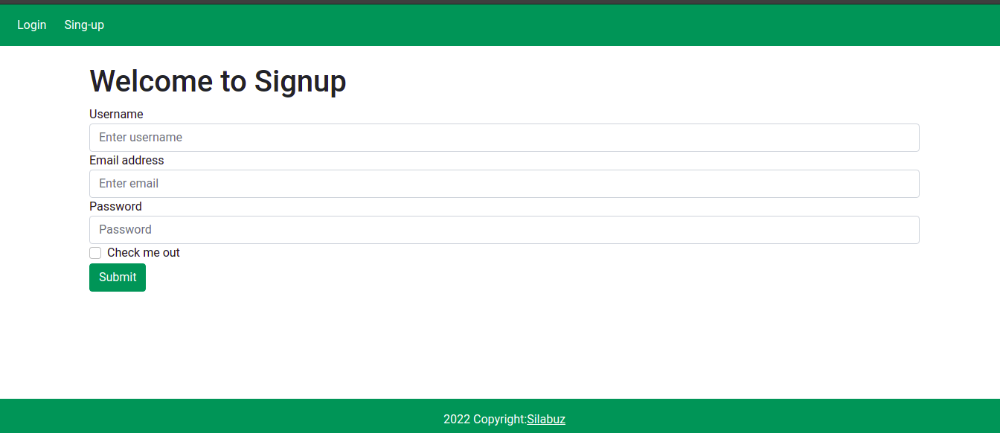
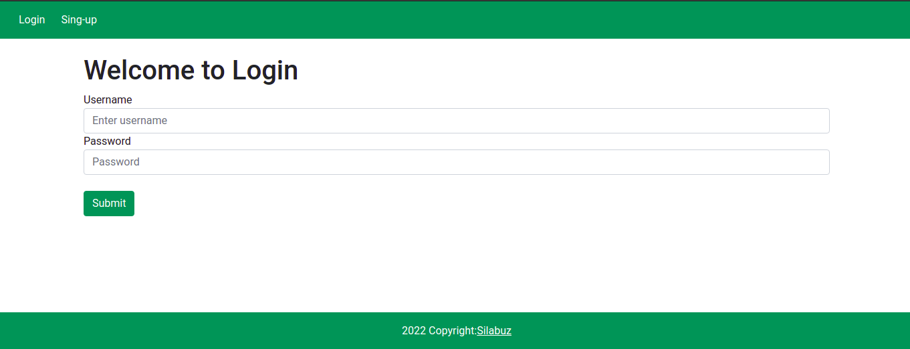
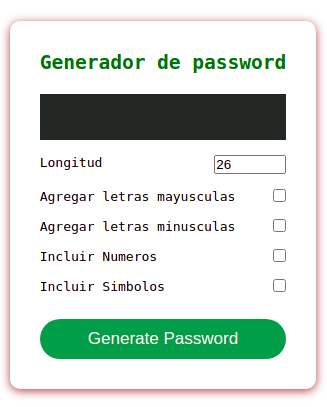
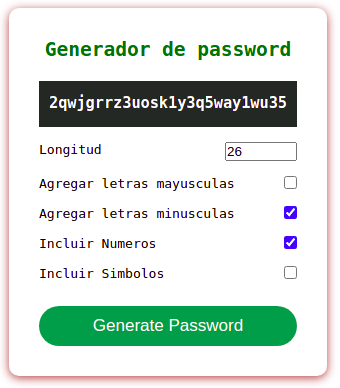
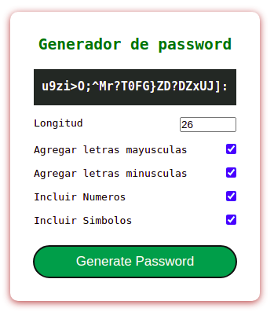
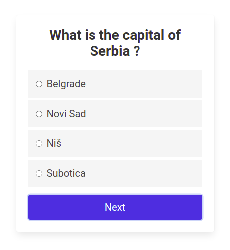
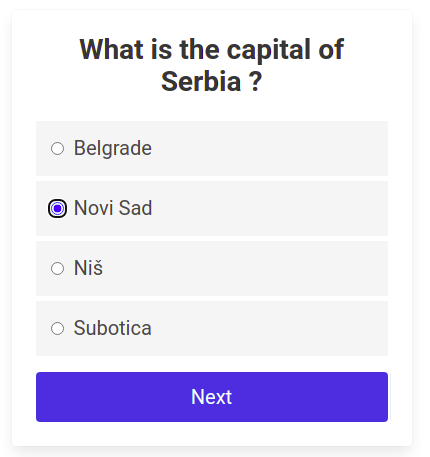
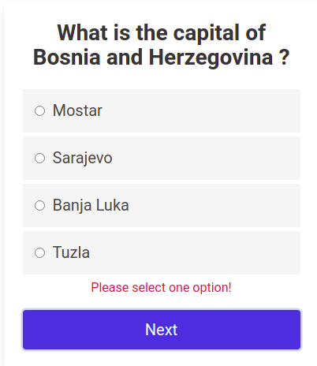
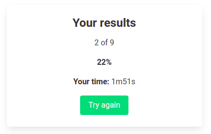

## 1 Exercise

URL: https://silabuz-api-project.herokuapp.com/authentication/sign-up/
URL: https://silabuz-api-project.herokuapp.com/authentication/login/

Crear una pagina web que contenga un layout que se mantenga en todo momento.
Se debe de permitir el registro de usuarios asi como la autenticacion de los mismos.

Una vez que se registra el usuario este debe de ser redirigido a la pagina de login, asimismo al completarse este segundo step el usuario debe ser redirigido a la pagina indice de la apliaccion en la que se le de un mensaje de bienvenida.

## 2 Exercise

Desarrollar una aplicacion en react que permita generar passwords.

se debe de marcar al menos un check y proveer la longitud del password para poder proceder con su generacion.

La clave generada debe hacer match con los criterios selecionados.

## 3 Exercise

Crear una aplicacion estilo cuestionario como se muestra en las imagenes.

No se debe permitir avanzar a una siguiente pregunta si antes no se marco una opcion.

Se deben mostrar los resultados al terminar de response la ultima pregunta del cuestionario.

