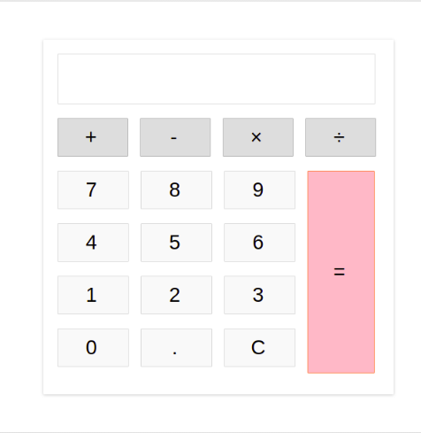

<!-- Indicaciones Generales -->

## Indicaciones Generales.

- Cada ejercicio debe estar alojado en su propia carpeta.
- Debe existir al menos un archivo index.html en el que se desarrolle el core del ejercicio.
- Los estilos deben estar en una hoja independiente llavada styles.css.
- EL codigo javascript debe estar en un archivo independiente llamado scripts.js.

<!-- Ejercicio 01-->

## Ejercicio 01

Crear una caluladora haciendo uso de html, css y javascript. Debe se ser capas de realizar las cuatro operaciones aritmetricas basicas (suma, resta, multiplicacion y division). El estilo es libre al gusto de cada persona, sin embargo una interfaz agradable es requerida.

**Resultado esperado**

